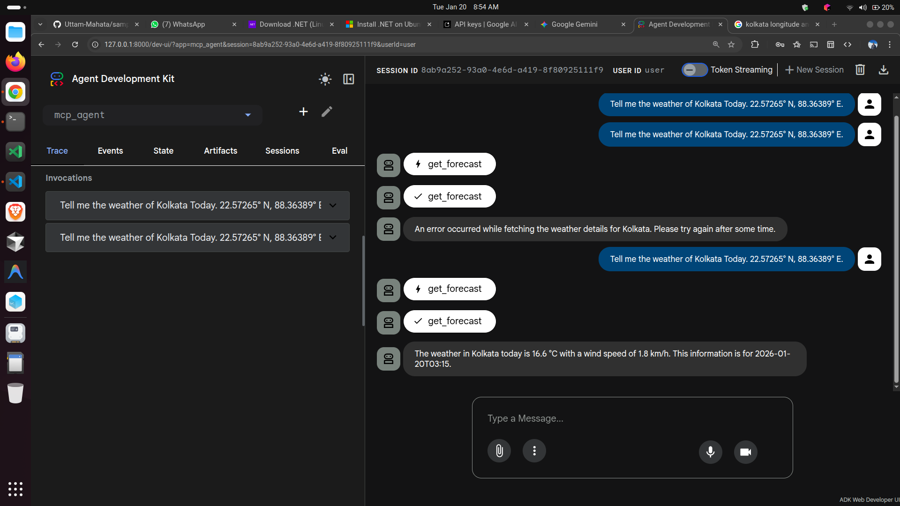

# Sample ADK .NET MCP Agent

This project demonstrates how to build a GenAI agent using the **Google Agent Development Kit (ADK)** in Python that connects to a **Model Context Protocol (MCP)** server implemented in **.NET**.

The system allows an LLM (Gemini) to call tools defined in C# (fetching weather data) seamlessly through the MCP standard.

## 📸 Demo



*The screenshot above shows the ADK Web Developer UI interacting with the `mcp_agent`. The user asks for the weather in Kolkata, and the agent invokes the `get_forecast` tool provided by the .NET MCP server to fulfill the request.*

## 🏗️ Architecture

1.  **MCP Server (.NET)**: A console application (`weather/`) that exposes two tools:
    *   `GetLocation`: resolving city names to coordinates.
    *   `GetForecast`: fetching weather data for specific coordinates.
2.  **ADK Agent (Python)**: A Python application (`adk-sample/`) that:
    *   Initializes a Google ADK `LlmAgent`.
    *   Connects to the .NET server via `StdioServerParameters` (launching the .NET executable as a subprocess).
    *   Exposes the MCP tools to the model.

## 🚀 Getting Started

### Prerequisites

*   **.NET SDK 10.0** (Preview) or compatible version for the server.
*   **Python 3.12+**
*   **uv** (Python package manager).
*   **Google Gen AI API Key** (for the ADK agent).

### 1. Build the MCP Server

Compile the .NET application to ensure the executable is ready.

```bash
cd weather
dotnet build
```

### 2. Configure the Agent

1.  Navigate to the sample directory:
    ```bash
    cd adk-sample
    ```

2.  Install dependencies:
    ```bash
    uv sync
    ```

3.  **Important**: Update the path to the .NET project.
    Open `adk-sample/mcp_agent/agent.py` and modify the `args` in `StdioServerParameters` to point to your absolute path for the `weather` folder.

    ```python
    # Example in agent.py
    args=[
        "run", 
        "--project", 
        "/ABSOLUTE/PATH/TO/sample-adk-dotnet-mcp/weather", # <--- Update this path
        "--no-build" 
    ]
    ```


To interact with the agent visually (as seen in the screenshot), you would typically use the ADK UI runner (instructions for setting up the full ADK UI environment are part of the broader ADK documentation).
